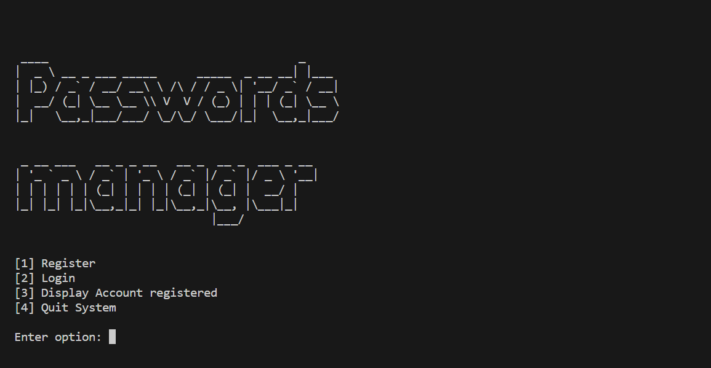
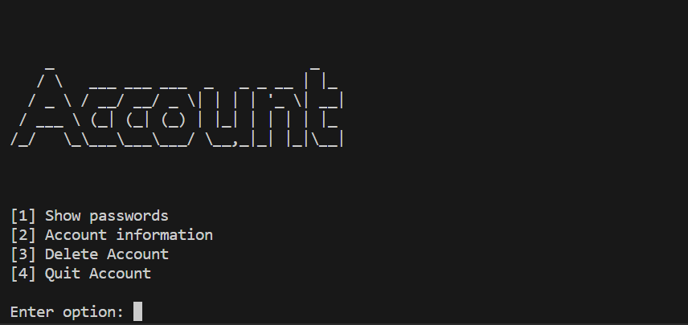
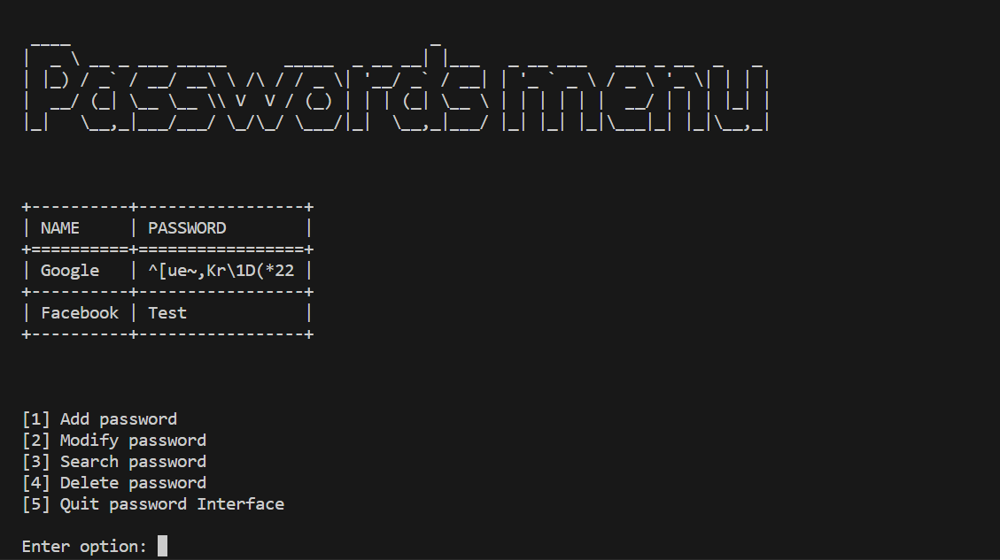

```
  ____                                     _       __  __
 |  _ \ __ _ ___ _____      _____  _ __ __| |___  |  \/  | __ _ _ __   __ _  __ _  ___ _ __
 | |_) / _` / __/ __\ \ /\ / / _ \| '__/ _` / __| | |\/| |/ _` | '_ \ / _` |/ _` |/ _ \ '__|
 |  __/ (_| \__ \__ \\ V  V / (_) | | | (_| \__ \ | |  | | (_| | | | | (_| | (_| |  __/ |
 |_|   \__,_|___/___/ \_/\_/ \___/|_|  \__,_|___/ |_|  |_|\__,_|_| |_|\__,_|\__, |\___|_|
                                                                            |___/
```
# Passwords Manager

For my CS50P [Final Project](https://cs50.harvard.edu/python/2022/project/), I decided to create a password manager with a user account system.

#### [Video Demo](https://youtu.be/p2FyHSRnj-M)

## Installation and Run

Use [pip](https://pip.pypa.io/en/stable/) to install all packages/requirements. Use [python](https://www.python.org/) to run the application

```
$ pip install -r requirements.txt
$ python project.py
```

## Description
__Application is divided into 3 coats:__

To perform any action, you need to write the number next to the desired action (to register, write 1...).

- The connection layer, which allows you to login, register, view registrants and exit the application.

  * To register, you will be asked to provide a number of details in specific formats: Name (no digits), date of birth (DD/MM/YYYY), Country (no digits), a valid e-mail address and a password of some kind.

  * To log in, you need either your e-mail address or your name and password

  * To display registered accounts, passwords are hidden and replaced by "*".
<div>
  
</div>

- The account layer is accessible only after an account has been logged in, and provides access to the password layer, and to information on the logged-in account (with account deletion).

  * When displaying account information, all information is displayed, including the password.

  * To delete the account, simply type "y" after selecting 3 for delete. Once the account has been deleted, it is impossible to go back!

<div>
  
</div>


- The password layer is the interface enabling a logged-in account to view its stored passwords and their names. From this layer you can : Add a password, modify, delete and search, or generate a random password.

  * To add passwords, you will be asked to enter a name and password, and you can also generate a random password.

  * To change a password, simply enter the name of the password or the password selected (password search function) and then, if a password has been found, you will be asked to keep the old name (type "k") and to keep the old password (type "k").

  * A deleted password cannot be restored!

<div>
  
</div>

## Files

The files named: **test_project.py** and **data_test.csv** are the files used to test the project's python file: **project.py**

The **data.csv** file contains all registered user accounts and their passwords

The **data.csv** file contains all the registered user accounts and their passwords.

The **passwords folder** contains a csv file named **namepassword.csv** for each account.

## License

[MIT](https://choosealicense.com/licenses/mit/)